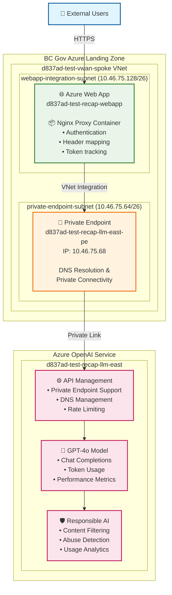
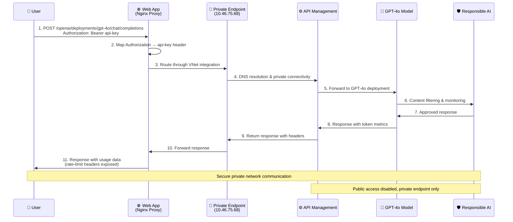
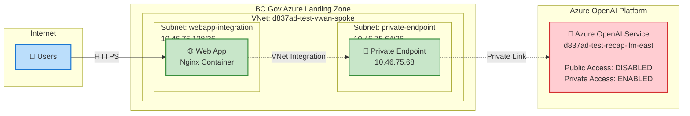

# RECAP LLM Responsible Evaluation And Consolidated Analytics Platform - Architecture

## System Overview

**BC Gov Azure Landing Zone**
- **VNet**: d837ad-test-vwan-spoke
  - **webapp-integration-subnet** (10.46.75.128/26)
    - **Azure Web App**: d837ad-test-recap-webapp
    - **Nginx Proxy Container**: Authentication, Header mapping, Token tracking
  - **private-endpoint-subnet** (10.46.75.64/26)
    - **Private Endpoint**: d837ad-test-recap-llm-east-pe (IP: 10.46.75.68)

**Azure OpenAI Service** (d837ad-test-recap-llm-east)
- **API Management**: Private Endpoint Support, DNS Management, Rate Limiting
- **GPT-4o Model**: Chat Completions, Token Usage, Performance Metrics
- **Responsible AI**: Content Filtering, Abuse Detection, Usage Analytics

**Data Flow:**
👤 External Users → 🌐 Azure Web App → 🔗 Private Endpoint → ⚙️ API Management → 🤖 GPT-4o → 🛡️ Responsible AI

## Data Flow Sequence

**Request Processing Steps:**
1. **User** → POST /openai/deployments/gpt-4o/chat/completions (Authorization: Bearer api-key)
2. **Web App (Nginx Proxy)** → Map Authorization → api-key header
3. **Web App** → Route through VNet integration to Private Endpoint
4. **Private Endpoint** → DNS resolution & private connectivity to API Management
5. **API Management** → Forward to GPT-4o deployment
6. **GPT-4o Model** → Content filtering & monitoring by Responsible AI
7. **Responsible AI** → Return approved response to GPT-4o
8. **GPT-4o Model** → Response with token metrics to API Management
9. **API Management** → Return response with headers to Private Endpoint
10. **Private Endpoint** → Forward response to Web App
11. **Web App** → Response with usage data to User (rate-limit headers exposed)

**Security Notes:**
- Secure private network communication throughout
- Public access disabled, private endpoint only
- All traffic remains within BC Gov Azure Landing Zone

## Network Architecture

**Network Topology:**
- **Internet** → **BC Gov Azure Landing Zone** → **Azure OpenAI Platform**

**BC Gov Azure Landing Zone:**
- **VNet**: d837ad-test-vwan-spoke
  - **webapp-integration subnet** (10.46.75.128/26): Web App with Nginx Container
  - **private-endpoint subnet** (10.46.75.64/26): Private Endpoint (10.46.75.68)

**Azure OpenAI Platform:**
- **Service**: d837ad-test-recap-llm-east
- **Public Access**: DISABLED
- **Private Access**: ENABLED via Private Link

**Connection Flow:**
👤 Users --HTTPS--> 🌐 Web App --VNet Integration--> 🔗 Private Endpoint --Private Link--> 🤖 Azure OpenAI Service

## Architecture Components

### Web Application Tier
- **Azure Web App**: `d837ad-test-recap-webapp.azurewebsites.net`
- **Container**: Nginx proxy with authentication handling
- **VNet Integration**: Connected to `webapp-integration-subnet`

### Network Tier  
- **Virtual Network**: `d837ad-test-vwan-spoke` 
- **Subnets**: 
  - `webapp-integration-subnet` (10.46.75.128/26)
  - `private-endpoint-subnet` (10.46.75.64/26)
- **Private Endpoint**: `d837ad-test-recap-llm-east-pe` (10.46.75.68)

### AI Service Tier
- **Azure OpenAI**: `d837ad-test-recap-llm-east`
- **API Management**: Full private endpoint support with DNS management
- **Model**: GPT-4o deployment with rate limiting and usage analytics
- **Security**: Public access disabled, private endpoint connectivity enabled

### Authentication Flow
1. User → `Authorization: <api-key>` header
2. Nginx → Maps to `api-key: <api-key>` header  
3. Private endpoint → Routes to Azure OpenAI
4. DNS resolution and secure connectivity established

### Deployment Architecture
- Secure private endpoint connectivity
- Comprehensive API management and monitoring
- Scalable container-based web application tier