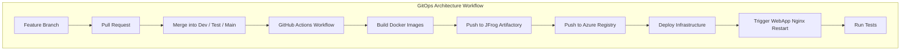
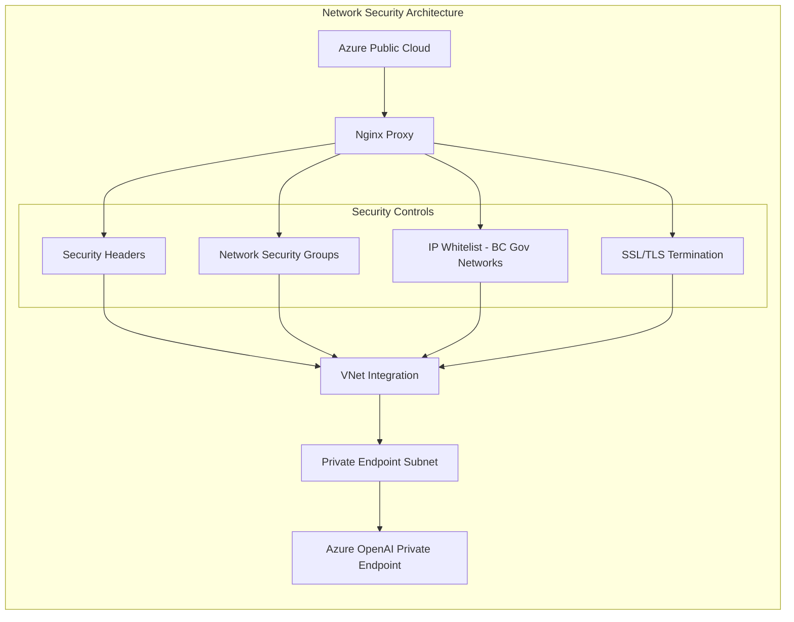

# ECON Azure API Deployment

## Overview

Deployment pipeline for the RECAP (Responsible Evaluation And Consolidated Analytics Platform) ECON Azure LLM API service provides a quick start foundation with PowerShell automation and GitHub Actions integration. There is a planned evolution into full GitOps with Terraform that will enhance automation, recovery and rollbacks.

### Source Code Repository Structure

The RECAP repository is organized with clear separation of concerns:

```bash
RECAP/
├── .github/workflows/               ← GitHub Actions
│   ├── docker-build-dev.yml         ← Dev branch deployment
│   ├── docker-build-test.yml        ← Test branch deployment  
│   ├── docker-build-main.yml        ← Main/Prod deployment
│   ├── pr-check-*-branch.yml        ← Branch-specific PR validation
│   └── manual-trigger.yml           ← Manual deployment triggers
├── recap-subnet-nsg/                ← Networking infrastructure
│   ├── networking-config.ps1        ← Subnets, NSGs, security rules
│   └── private-endpoint-deploy.ps1  ← Private endpoints
├── recap-llm/                       ← OpenAI service deployment
│   └── openai-deploy.ps1            ← Azure OpenAI service creation
├── recap-web-proxy/                 ← Web app and proxy layer
│   ├── nginx-generate-config.ps1    ← Environment-specific nginx config
│   ├── acr-container-push.ps1       ← Container build and ACR push
│   ├── webapp-deploy.ps1            ← Azure Web App deployment
│   └── proxy-llm-basic-test.ps1     ← End-to-end connectivity testing
├── deploy-all-resources.ps1         ← Orchestrated deployment script
├── clean-all-resources.ps1          ← Clean-up automation
└── documentation/                   ← Architecture and operational docs
```

### Current Deployment Pipeline



### Current Tools and Services

#### 1. GitHub Actions (Following Unity Project Pattern)

- **Branch-specific workflows**: Separate workflows for dev/test/main branches
- **Docker image builds**: Automated container creation with build arguments using peer-reviewed Pull Requests
- **Multi-registry push**: Images pushed to both JFrog Artifactory and Azure container registry for disaster recovery and rollback
- **Environment-specific configurations**: Each environment has dedicated workflow variables, keys, login roles

**Key Components:**

- **Secrets Management**: GitHub secrets for authentication (ARTIFACTORY_*, Azure_*, GH_API_TOKEN)
- **Environment Variables**: Branch-specific build versions and deployment targets
- **Container Registries**: GitHub Action Runners + JFrog Artifactory + Azure internal container registry
- **Deployment Triggers**: GitHub Actions + WebApp Nginx container restarts via Azure CLI

#### 2. PowerShell Infrastructure Scripts

- **Modular deployment approach**: Separate scripts for networking, OpenAI, and web proxy
- **Environment parameterization**: test/prod environment support
- **Azure CLI integration**: Direct Azure resource management
- **Orchestrated execution**: `deploy-all-resources.ps1` coordinates full deployment

#### 3. Azure Container Registry

- **Container storage**: Houses multiple tagged versions of nginx proxy docker images
- **Environment-specific tags**: dev/test/prod image versioning {latest, stable, v0.1.0, etc.}

### Security Configurations

#### Network Security



#### Access Controls

- **Private Endpoints**: Azure OpenAI accessible only via private network (10.*.*.*:443)
- **Network Security Groups**: BC Gov compliant firewall rules deny all
- **IP Whitelisting**: BC Government server network access least allowed
- **SSL/TLS**: End-to-end encryption with proxy SSL termination
- **API Key Management**: Secure credential handling via Azure Key Vault integration

#### Security Headers (nginx.conf)

```nginx
add_header X-Frame-Options "SAMEORIGIN" always;
add_header X-Content-Type-Options "nosniff" always;
add_header Referrer-Policy "strict-origin-when-cross-origin" always;
add_header Content-Security-Policy "object-src 'none'; frame-ancestors 'none'" always;
add_header Strict-Transport-Security "max-age=31536000; includeSubDomains; preload" always;
proxy_cookie_flags ~ secure samesite=strict;
```

### Deployment Manifest Usage

#### Current Approach

- **PowerShell orchestration**: `deploy-all-resources.ps1` coordinates deployment sequence
- **Environment-specific parameters**: test/prod configuration via script parameters  
- **Sequential execution**: multi-step deployment process with error handling
- **Logging and monitoring**: Comprehensive deployment logs with timestamps

#### Deployment Step Sequence

1. **Networking Infrastructure**: Subnets, NSGs, private endpoint prerequisites
2. **Azure OpenAI Service**: Cognitive Services account with model deployments
3. **Private Endpoint Creation**: Secure connectivity setup
4. **Nginx Configuration**: Environment-specific proxy configuration
5. **Container Build & Push**: Docker image creation and image deployment
6. **Web App Deployment**: Azure Web App with VNet integration
7. **End-to-End Testing**: Connectivity and API validation

## Planned Future State

### Future Implementation Planning

#### 1. GitHub Actions Workflow Structure (Based on bcgov/Unity workflows)

```hcl
# Planned workflow structure
.github/workflows/
├── infrastructure-dev.yml      # Terraform infrastructure for dev
├── infrastructure-test.yml     # Terraform infrastructure for test  
├── infrastructure-prod.yml     # Terraform infrastructure for prod
├── docker-build-deploy.yml     # Container build and deployment
├── pr-validation.yml           # Pull request checks
└── manual-deploy.yml           # Manual deployment triggers
```

#### 2. Branch Strategy

- **Feature branches** → **dev branch** → **test branch** → **main branch**
- **Environment mapping**: dev branch = dev environment, test branch = test environment, main branch = production

#### 3. Terraform Infrastructure as Code

```hcl
# Planned Terraform structure
terraform/
├── modules/
│   ├── networking/             # VNet, subnets, NSGs
│   ├── azure-openai/           # Cognitive Services
│   ├── web-app/                # App Service and containers
│   └── security/               # Key Vault, private endpoints
├── environments/
│   ├── dev/                    # Dev environment config
│   ├── test/                   # Test environment config  
│   └── prod/                   # Production environment config
└── shared/                     # Shared resources
```

#### 4. Container Registry Strategy

- **Automated scanning**: Azure Defender for container vulnerability scanning
- **Private endpoints**: Accessible only via Azure private network

#### 5. Deployment Manifest Evolution

**Current PowerShell → Future Terraform Templates:**

```yaml
apiVersion: 2021-04-01
kind: Template
metadata:
  name: recap-deployment
spec:
  parameters:
    environment: dev|test|prod
    version: string
  resources:
    - type: Microsoft.Web/sites
    - type: Microsoft.CognitiveServices/accounts  
    - type: Microsoft.Network/privateEndpoints
```

### Improvement Strategy

#### 1: GitHub Actions Integration

- [ ] Implement Docker build workflows using bcgov/Unity patterns
- [ ] Integrate with Azure Container Registry for Nginx proxy
- [ ] Maintain PowerShell scripts for infrastructure during transition

#### 2: Terraform Infrastructure

- [ ] Convert PowerShell scripts to Terraform modules
- [ ] Implement environment-specific Terraform configurations
- [ ] Add Terraform state management in Azure Storage

#### 3: Full GitOps Implementation

- [ ] Environment promotion via branch merges
- [ ] Automated testing and validation
- [ ] Monitoring and alerting integration

#### 4: Azure DevOps Project Integration

- [ ] Issues and ticket management remain in ECON Azure DevOps
- [ ] Business Area Approval workflows for production deployments

### Technical Benefits

- **Infrastructure as Code**: Version-controlled, repeatable infrastructure
- **Automated Testing**: Consistent validation across environments
- **Faster Deployments**: Reduced manual intervention and deployment time
- **Environment Parity**: Identical environments through code-based definitions

### Operational Benefits

- **Reduced Manual Errors**: Automated deployment reduces human error
- **Audit Trail**: Complete deployment history via Git commits
- **Rollback Capability**: Quick rollback to previous known-good states
- **Compliance**: BC Gov compliance through standardized, auditable processes

### Security Benefits

- **Secret Management**: Azure Key Vault integration with GitHub Actions
- **Least Privilege**: Service Principal access with minimal required permissions
- **Network Isolation**: Maintained private endpoint architecture
- **Container Scanning**: Automated vulnerability assessment
