# RECAP Azure Landing Zone Documentati    %% Network Security Groups
    PENSG[🛡️ Private Endpoint NSG<br/>d837ad-test-pe-nsg<br/>Traffic Control]
    WANSG[🛡️ Web App NSG<br/>d837ad-test-webapp-nsg<br/>App Security]
    
    %% Subnets (as separate nodes for clarity)
    PESubnet[🔒 PE Subnet<br/>10.46.75.0/27]
    WASubnet[🌐 WebApp Subnet<br/>10.46.75.32/28]verview

This document provides detailed information about the Azure Landing Zone configuration and architecture for the RECAP (Responsible Evaluation And Consolidated Analytics Platform) project.

## Architecture Screenshots

### Resource Visualizer - Test Environment
*Figure 1: Azure Resource Visualizer showing the complete RECAP test environment infrastructure with all component relationships*

**Live View**: [Open in Azure Portal Resource Visualizer](https://portal.azure.com/#view/HubsExtension/BrowseResourcesListBlade/resourceType/Microsoft.Resources%2Fresources)

#### Interactive Architecture Diagram

```mermaid
flowchart TB
    %% External
    Internet[🌍 Internet<br/>External Users]
    
    %% Azure AI Services
    AI[🧠 Azure AI Foundry<br/>d837ad-test-econ-llm-east<br/>GPT-4o & GPT-4o-mini]
    
    %% Container Registry
    ACR[📦 Container Registry<br/>d837adtestcontainers<br/>Image Storage]
    
    %% Virtual Network Components
    VNet[🌐 VNet<br/>d837ad-test-vwan-spoke<br/>10.46.75.0/24]
    
    %% Private Endpoint
    PE[🔗 Private Endpoint<br/>d837ad-test-econ-llm-east-pe<br/>Secure Connection]
    
    %% Web Application
    WebApp[🌍 Azure App Service<br/>d837ad-test-recap-webapp<br/>RECAP Proxy]
    
    %% App Service Plan
    ASP[💻 App Service Plan<br/>d837ad-test-recap-asp<br/>B1 Linux Hosting]
    
    %% Network Security Groups
    PENSG[🛡️ Private Endpoint NSG<br/>d837ad-test-pe-nsg<br/>Traffic Control]
    WANSG[🛡️ Web App NSG<br/>d837ad-test-webapp-nsg<br/>App Security]
    
    %% Network Watcher
    NW[📊 Network Watcher<br/>canadacentr<br/>Monitoring]
    
    %% Subnets (as separate nodes for clarity)
    PESubnet[🔒 PE Subnet<br/>10.46.75.0/27]
    WASubnet[� WebApp Subnet<br/>10.46.75.32/28]
    
    %% Main Traffic Flow
    Internet --> WebApp
    WebApp --> WASubnet
    WASubnet --> VNet
    VNet --> PESubnet
    PESubnet --> PE
    PE --> AI
    
    %% Container Deployment
    ACR --> WebApp
    
    %% Infrastructure Dependencies
    ASP --> WebApp
    
    %% Security Enforcement
    PENSG -.-> PESubnet
    WANSG -.-> WASubnet
    
    %% Styling
    classDef aiService fill:#4285f4,stroke:#333,stroke-width:2px,color:#fff
    classDef container fill:#ff9800,stroke:#333,stroke-width:2px,color:#fff
    classDef network fill:#9c27b0,stroke:#333,stroke-width:2px,color:#fff
    classDef security fill:#f44336,stroke:#333,stroke-width:2px,color:#fff
    classDef compute fill:#2196f3,stroke:#333,stroke-width:2px,color:#fff
    classDef monitor fill:#607d8b,stroke:#333,stroke-width:2px,color:#fff
    classDef external fill:#4caf50,stroke:#333,stroke-width:2px,color:#fff
    
    class AI aiService
    class ACR container
    class VNet,PE,PESubnet,WASubnet network
    class PENSG,WANSG security
    class WebApp,ASP compute
    class Internet external
```


### Cost Analysis - Test Environment
*Figure 2: Azure Cost Analysis showing daily operating costs for RECAP test environment (August 6, 2025)*

### Network Configuration Detail
*Figure 3: Detailed view of the VNet configuration, subnets, and network security groups*

## Cost Analysis and Economics

### Daily Operating Costs (No Load)
Based on the Azure Cost Analysis for August 6, 2025, the RECAP test environment operates at **CA$0.83 per day** with no active workloads.

### Cost Breakdown by Service

| Service | Service Tier | Meter | Daily Cost | Notes |
|---------|-------------|--------|------------|-------|
| **Azure App Service** | Basic Plan-Linux (B1) | B1 | CA$0.02 | Minimal cost for basic hosting |
| **Azure App Service** | Free Plan | F1 App | CA$0 | Development/testing instances |
| **Cognitive Services** | OpenAI | GPT-4o Input Tokens | <CA$0.01 | Pay-per-use AI model |
| **Cognitive Services** | OpenAI | GPT-4o Output Tokens | <CA$0.01 | Response generation costs |
| **Cognitive Services** | OpenAI | GPT-4o-mini Input Tokens | <CA$0.01 | Cost-effective mini model |
| **Cognitive Services** | OpenAI | GPT-4o-mini Output Tokens | <CA$0.01 | 94% cheaper than GPT-4o |
| **Container Registry** | Basic Registry Unit | - | CA$0.16 | Image storage and pulls |
| **Virtual Network** | Private Link | Standard Private Endpoint | CA$0.24 | Secure connectivity |
| **Microsoft Defender** | App Service | Standard Node | CA$0.41 | Security monitoring |
| **Microsoft Defender** | Resource Manager | Standard Events | CA$0.01 | Resource protection |
| **Microsoft Defender** | AI Services | Standard Tokens | <CA$0.01 | AI workload security |
| **Bandwidth** | Data Transfer | Standard Out | CA$0 | Minimal outbound traffic |

### Monthly Cost Projection
- **Test Environment**: CA$0.83/day × 30 days = **~CA$25/month**
- **Production Environment**: Estimated **~CA$50-75/month** (higher availability, monitoring)

### Cost Optimization Opportunities

#### Immediate Savings
1. **App Service Plan**: Consider scaling down to F1 (Free) for development
2. **Container Registry**: Monitor image retention policies
3. **Private Endpoints**: Review necessity for development workloads

#### Token Usage Optimization
- **GPT-4o-mini**: 94% cheaper than GPT-4o for most use cases
- **Input/Output Ratio**: Monitor to optimize prompt engineering
- **Caching**: Implement response caching to reduce repeat calls

#### Security vs. Cost Balance
- **Microsoft Defender**: CA$0.43/day for comprehensive security
- **Private Endpoints**: CA$0.24/day for network isolation
- Combined security overhead: **~52% of total daily cost**

### Cost Scaling Characteristics

#### Light Production Load (100 requests/day)
- AI Token costs: +CA$0.10-0.50/day
- Total estimated: **CA$1.00-1.50/day**

#### Medium Production Load (1,000 requests/day)  
- AI Token costs: +CA$1.00-5.00/day
- Total estimated: **CA$2.00-6.00/day**

#### High Production Load (10,000 requests/day)
- AI Token costs: +CA$10.00-50.00/day
- App Service scaling: +CA$1.00-3.00/day
- Total estimated: **CA$12.00-54.00/day**

### Economic Benefits

#### Model Cost Comparison
- **GPT-4o**: $2.50 input / $10.00 output per 1M tokens
- **GPT-4o-mini**: $0.15 input / $0.60 output per 1M tokens
- **Savings**: 94% reduction using mini model for appropriate workloads

#### Infrastructure Value
- **Zero-maintenance AI**: No model hosting, training, or GPU costs
- **Elastic scaling**: Pay only for actual usage
- **Enterprise security**: Included monitoring and compliance features

## Landing Zone Components

Based on the Azure Resource Visualizer shown above, the RECAP test environment contains the following components:

### Core AI Services
- **d837ad-test-econ-llm-east**: Azure AI Foundry (Cognitive Services)
  - Provides GPT-4o and GPT-4o-mini model deployments
  - Configured with private network access only

### Container Infrastructure  
- **d837adtestcontainers**: Azure Container Registry
  - Stores the RECAP web proxy container images
  - Integrated with web app deployment pipeline

### Networking Infrastructure
- **d837ad-test-vwan-spoke**: Virtual Network (VNet)
  - Contains all private subnets and security groups
  - Provides secure connectivity backbone

### Private Connectivity
- **d837ad-test-econ-llm-east-pe**: Private Endpoint
  - Secures connection between VNet and Azure OpenAI service
  - Enables private network access to AI services
  - Connected to private endpoint subnet with dedicated IP

### Network Security
- **d837ad-test-pe-nsg**: Private Endpoint Network Security Group
  - Controls traffic to/from private endpoint subnet
  - Allows SPANBC network access (142.22.0.0/16)
- **d837ad-test-webapp-nsg**: Web App Network Security Group  
  - Secures web app integration subnet traffic
  - Permits outbound connectivity to private endpoint

### Compute Platform
- **d837ad-test-recap-webapp**: Azure App Service
  - Hosts the RECAP web proxy application
  - Integrated with VNet for private endpoint access
- **d837ad-test-recap-asp**: App Service Plan
  - B1 Linux plan supporting containerized workloads

### Resource Groups
- **d837ad-test-networking**: Test environment resources
- **d837ad-prod-networking**: Production environment resources

### Virtual Networks
- **Test Environment**: `d837ad-test-vwan-spoke` (10.46.75.0/24)
- **Production Environment**: `d837ad-prod-vwan-spoke` (10.46.76.0/24)

### Subnets
#### Test Environment (10.46.75.0/24)
- Private Endpoint Subnet: `10.46.75.0/27` (27 usable IPs)
- Web App Integration Subnet: `10.46.75.32/28` (11 usable IPs)

#### Production Environment (10.46.76.0/24)
- Private Endpoint Subnet: `10.46.76.0/27` (27 usable IPs)
- Web App Integration Subnet: `10.46.76.32/28` (11 usable IPs)

### Network Security Groups
- **Private Endpoint NSGs**: Control access to OpenAI private endpoints
- **Web App Integration NSGs**: Secure web app to private endpoint connectivity

## Security Configuration

### Private Endpoints
- Azure OpenAI services are deployed with `publicNetworkAccess: Disabled`
- Private endpoints provide secure connectivity within the VNet
- Custom DNS configuration for internal name resolution

### Network Access Rules
- VNet rules explicitly authorize specific subnets
- SPANBC network access (142.22.0.0/16) allowed on port 443
- Default action: Deny for enhanced security

## Deployment Architecture

### Infrastructure Components
1. **Networking Layer**: VNets, subnets, NSGs, private endpoints
2. **Compute Layer**: Azure Web Apps with VNet integration
3. **AI Services Layer**: Azure OpenAI with private endpoint connectivity
4. **Container Layer**: Azure Container Registry for application images

### Environment Separation
- Complete isolation between test and production environments
- Separate IP address ranges to prevent conflicts
- Environment-specific resource naming conventions

## Resource Relationships and Connectivity

Based on the Azure Resource Visualizer diagram, the following connectivity patterns are established:

### Primary Data Flow
```
Internet → d837ad-test-recap-webapp (App Service) 
       ↓ (VNet Integration)
       → d837ad-test-vwan-spoke (Virtual Network)
       ↓ (Private Endpoint)  
       → d837ad-test-econ-llm-east-pe (Private Endpoint)
       ↓ (Secure Connection)
       → d837ad-test-econ-llm-east (Azure OpenAI)
```

### Container Deployment Flow
```
d837adtestcontainers (ACR) → d837ad-test-recap-webapp (App Service)
```

### Network Security Enforcement
- **d837ad-test-pe-nsg**: Protects private endpoint subnet
- **d837ad-test-webapp-nsg**: Secures web app integration subnet

### Resource Dependencies
1. **App Service Plan** (`d837ad-test-recap-asp`) hosts the **App Service** (`d837ad-test-recap-webapp`)
2. **Private Endpoint** (`d837ad-test-econ-llm-east-pe`) connects **VNet** to **Azure OpenAI**
3. **Network Security Groups** control traffic between all subnet resources
4. **Container Registry** provides application images to **App Service**

## Connectivity Flow

```
Internet → Azure Web App → VNet Integration → Private Endpoint → Azure OpenAI Service
```

### Traffic Path
1. External requests reach Azure Web App (public endpoint)
2. Web App processes requests using VNet integration
3. Traffic flows through web app integration subnet
4. Private endpoint provides secure access to OpenAI service
5. Responses return through the same secure path

## Monitoring and Compliance

### Logging
- All network traffic logged through NSG flow logs
- Azure OpenAI service logs for request monitoring
- Web App diagnostic logs for application monitoring

### Compliance Features
- Public network access disabled for sensitive services
- Network segmentation through subnets and NSGs
- Private endpoint encryption for data in transit

## Deployment Scripts

### Automated Deployment
- `networking-config.ps1`: Creates VNets, subnets, and NSGs
- `openai-deploy.ps1`: Deploys Azure OpenAI services
- `private-endpoint-deploy.ps1`: Creates private endpoints
- `webapp-deploy.ps1`: Deploys web applications with VNet integration

### Testing and Validation
- `proxy-llm-basic-test.ps1`: End-to-end connectivity testing
- Environment-specific validation for both test and production

---

**Document Version**: 1.0  
**Last Updated**: August 6, 2025  
**Created By**: RECAP Development Team  
**Status**: Active
