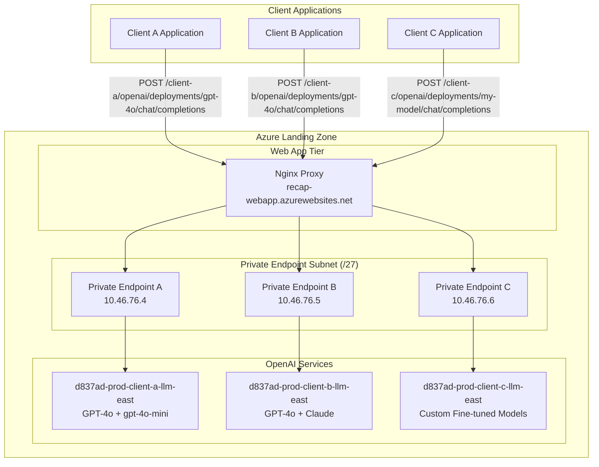
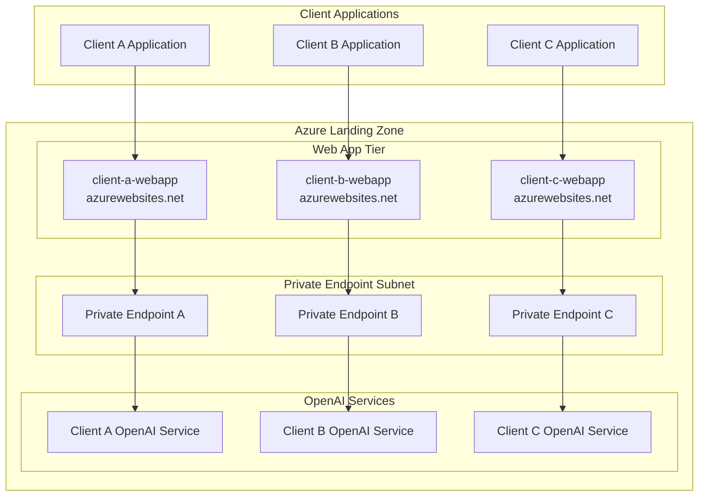

# RECAP Multi-Client Solution Architecture

## Overview

RECAP (Responsible Evaluation And Consolidated Analytics Platform) can be configured to serve multiple clients through a scalable, secure, and cost-effective architecture within BC Gov's Azure Landing Zone.

## Architecture Options

### Option 1: Single Proxy with Path-Based Routing (Recommended)



**Benefits:**
- ✅ **Cost Effective**: Single web app serves all clients
- ✅ **Centralized Management**: One nginx configuration
- ✅ **Minimal IP Usage**: Reuses existing subnets
- ✅ **BC Gov Compliance**: Consistent security policies
- ✅ **Easy Client Onboarding**: Add routing rules without infrastructure changes

**Nginx Configuration:**
```nginx
# Client A - Standard models
location /client-a/openai/ {
    proxy_pass https://10.46.76.4:443/openai/;
    proxy_set_header Host d837ad-prod-client-a-llm-east.openai.azure.com;
    proxy_set_header api-key $http_x_client_a_key;
    
    # Rate limiting per client
    limit_req zone=client_a burst=10 nodelay;
}

# Client B - Premium models
location /client-b/openai/ {
    proxy_pass https://10.46.76.5:443/openai/;
    proxy_set_header Host d837ad-prod-client-b-llm-east.openai.azure.com;
    proxy_set_header api-key $http_x_client_b_key;
    
    # Higher rate limits for premium client
    limit_req zone=client_b burst=50 nodelay;
}

# Client C - Custom models
location /client-c/openai/ {
    proxy_pass https://10.46.76.6:443/openai/;
    proxy_set_header Host d837ad-prod-client-c-llm-east.openai.azure.com;
    proxy_set_header api-key $http_x_client_c_key;
}
```

### Option 2: Dedicated Web Apps per Client



**Benefits:**
- ✅ **Complete Isolation**: Full separation between clients
- ✅ **Independent Scaling**: Per-client resource allocation
- ✅ **Custom Configurations**: Client-specific settings
- ✅ **Separate Monitoring**: Individual logging and metrics

**Drawbacks:**
- ❌ **Higher Costs**: Multiple App Service Plans required
- ❌ **More IP Addresses**: Additional subnet capacity needed
- ❌ **Complex Management**: Multiple deployments to maintain

### Option 3: Header-Based Routing (Advanced)

```nginx
# Route based on custom header
map $http_x_client_id $backend_service {
    "client-a" "https://10.46.76.4:443";
    "client-b" "https://10.46.76.5:443"; 
    "client-c" "https://10.46.76.6:443";
    default "https://10.46.76.4:443";
}

map $http_x_client_id $backend_host {
    "client-a" "d837ad-prod-client-a-llm-east.openai.azure.com";
    "client-b" "d837ad-prod-client-b-llm-east.openai.azure.com";
    "client-c" "d837ad-prod-client-c-llm-east.openai.azure.com";
    default "d837ad-prod-client-a-llm-east.openai.azure.com";
}

location /openai/ {
    proxy_pass $backend_service/openai/;
    proxy_set_header Host $backend_host;
    proxy_set_header api-key $http_x_api_key;
}
```

## Scalability Analysis

### Current Production VNet Capacity
**Address Space**: `10.46.76.0/24` (256 total IPs)

**Optimized Subnets:**
- **private-endpoint-subnet**: `10.46.76.0/27` (32 IPs, ~27 usable)
- **webapp-integration-subnet**: `10.46.76.32/28` (16 IPs, ~11 usable)
- **Available for expansion**: `10.46.76.48/28` onwards (208 remaining IPs)

### Capacity Estimates
- **OpenAI Services**: Unlimited (can use separate resource groups)
- **Private Endpoints**: ~25 per private-endpoint-subnet (/27 sizing)
- **Web Apps**: ~10 in webapp-integration-subnet (/28 sizing)
- **Expansion**: Additional subnets can be created from remaining /28 blocks

## Client Usage Examples

### Client A - Standard Access
```bash
curl -X POST "https://recap-webapp.azurewebsites.net/client-a/openai/deployments/gpt-4o/chat/completions" \
  -H "X-Client-A-Key: sk-client-a-key-here" \
  -H "Content-Type: application/json" \
  -d '{
    "messages": [
      {"role": "user", "content": "Hello"}
    ],
    "max_tokens": 100
  }'
```

### Client B - Premium Access
```bash
curl -X POST "https://recap-webapp.azurewebsites.net/client-b/openai/deployments/gpt-4o/chat/completions" \
  -H "X-Client-B-Key: sk-client-b-key-here" \
  -H "Content-Type: application/json" \
  -d '{
    "messages": [
      {"role": "user", "content": "Complex analysis request"}
    ],
    "max_tokens": 2000
  }'
```

### Client C - Custom Models
```bash
curl -X POST "https://recap-webapp.azurewebsites.net/client-c/openai/deployments/my-custom-model/chat/completions" \
  -H "X-Client-C-Key: sk-client-c-key-here" \
  -H "Content-Type: application/json" \
  -d '{
    "messages": [
      {"role": "user", "content": "Domain-specific query"}
    ],
    "max_tokens": 500
  }'
```

## Client Onboarding Process

### Step 1: Deploy OpenAI Service
```powershell
# Navigate to recap-llm directory
cd C:\opt\Repository\RECAP\recap-llm

# Deploy new OpenAI service for client
.\deploy-azure-openai.ps1 -Environment "prod-client-b" -ResourceGroup "d837ad-prod-networking" -Location "canadaeast"
```

This creates:
- Azure OpenAI service: `d837ad-prod-client-b-econ-llm-east`
- GPT-4o deployment with Standard SKU
- gpt-4o-mini deployment with ProvisionedManaged SKU

### Step 2: Create Private Endpoint
```bash
# Create private endpoint for new OpenAI service
az network private-endpoint create \
  --name "d837ad-prod-client-b-llm-pe" \
  --resource-group "d837ad-prod-networking" \
  --subnet "private-endpoint-subnet" \
  --private-connection-resource-id "/subscriptions/d78519cd-820a-4843-bc58-7c5b2ba339df/resourceGroups/d837ad-prod-networking/providers/Microsoft.CognitiveServices/accounts/d837ad-prod-client-b-econ-llm-east" \
  --connection-name "client-b-openai-connection" \
  --group-id "account"
```

### Step 3: Update Nginx Configuration
Add new client routing to `recap-web-proxy/nginx.conf`:

```nginx
# Client B configuration
location /client-b/openai/ {
    proxy_pass https://10.46.76.5:443/openai/;
    proxy_set_header Host d837ad-prod-client-b-econ-llm-east.openai.azure.com;
    proxy_set_header api-key $http_x_client_b_key;
    
    # Client-specific rate limiting
    limit_req zone=client_b burst=25 nodelay;
    
    # Connection pooling for reliability
    proxy_set_header Connection "";
    proxy_http_version 1.1;
}
```

### Step 4: Redeploy Web App Container
```bash
# Rebuild and deploy updated nginx container
cd C:\opt\Repository\RECAP\recap-web-proxy
docker build -t recap-web-proxy:latest .
# Push to ACR and restart web app
```

### Step 5: Provide Client Credentials
```json
{
  "client_id": "client-b",
  "endpoint": "https://recap-webapp.azurewebsites.net/client-b/openai/",
  "api_key_header": "X-Client-B-Key",
  "api_key": "sk-client-b-specific-key",
  "available_models": {
    "gpt-4o": {
      "endpoint": "/client-b/openai/deployments/gpt-4o/chat/completions",
      "context_window": 128000,
      "max_tokens": 4096
    },
    "gpt-4o-mini": {
      "endpoint": "/client-b/openai/deployments/gpt-4o-mini/chat/completions", 
      "context_window": 128000,
      "max_tokens": 16384
    }
  },
  "rate_limits": {
    "requests_per_minute": 50,
    "tokens_per_minute": 100000
  }
}
```

## Management & Monitoring

### Per-Client Logging
```nginx
# Enhanced log format with client identification
log_format client_log '$remote_addr - $http_x_client_id [$time_local] '
                     '"$request" $status $body_bytes_sent '
                     '"$http_referer" "$http_user_agent" '
                     '$request_time $upstream_response_time '
                     '$http_x_client_a_key$http_x_client_b_key$http_x_client_c_key';

access_log /var/log/nginx/client_access.log client_log;
```

### Rate Limiting Configuration
```nginx
# Define rate limiting zones per client
limit_req_zone $http_x_client_a_key zone=client_a:10m rate=10r/m;
limit_req_zone $http_x_client_b_key zone=client_b:10m rate=50r/m;
limit_req_zone $http_x_client_c_key zone=client_c:10m rate=25r/m;
```

### Cost Allocation Strategies

#### Option 1: Resource Group Separation
```
d837ad-prod-networking      # Shared infrastructure
d837ad-prod-client-a        # Client A OpenAI services
d837ad-prod-client-b        # Client B OpenAI services
d837ad-prod-client-c        # Client C OpenAI services
```

#### Option 2: Azure Tags for Cost Tracking
```json
{
  "Client": "client-a",
  "Environment": "production",
  "CostCenter": "ministry-program-a",
  "BillingCode": "project-alpha"
}
```

#### Option 3: Usage-Based Billing
- Monitor API calls per client through nginx logs
- Track token usage via Azure OpenAI metrics
- Generate monthly usage reports per client

## Security Considerations

### API Key Management
- **Separate API keys** for each OpenAI service
- **Header-based authentication** for client identification
- **Key rotation** procedures for each client
- **Azure Key Vault** integration for secure storage

### Network Security
- **Private endpoints only** - no public access to OpenAI services
- **NSG rules** restricting traffic to required ports
- **VNet integration** ensuring traffic stays within BC Gov network
- **SSL/TLS termination** at nginx proxy

### Compliance
- **BC Gov security policies** applied consistently
- **Audit logging** for all client requests
- **Data residency** maintained within Canada
- **PIPEDA compliance** for data handling

## Recommended Implementation

For BC Gov RECAP, we recommend **Option 1: Single Proxy with Path-Based Routing** because:

1. **Cost Efficiency**: One web app handles all clients (~$100/month vs $100/month per client)
2. **Centralized Management**: Single nginx configuration and deployment
3. **Security Consistency**: Uniform application of BC Gov security policies  
4. **Scalability**: Easy addition of new clients without infrastructure changes
5. **Monitoring Simplification**: Centralized logging and metrics collection
6. **Resource Optimization**: Efficient use of Azure Landing Zone IP addresses

## Future Enhancements

### Phase 2: Advanced Features
- **Client-specific model fine-tuning**
- **Usage analytics dashboard**
- **Automated client onboarding**
- **Multi-region deployment**

### Phase 3: Enterprise Features  
- **Active Directory integration**
- **Advanced rate limiting with quotas**
- **Real-time usage monitoring**
- **Automated scaling based on client demand**

---

*This document is part of the RECAP (Responsible Evaluation And Consolidated Analytics Platform) project for BC Government's Azure Landing Zone implementation.*